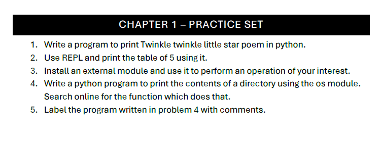

### Problem 1: Print Twinkle Twinkle Little Star Poem

```python
print('''
Twinkle twinkle little star.
How I wonder what you are.
Up above the world so high.
Like a diamond in the sky.
Twinkle twinkle little star.
How I wonder what you are.
''')
```

#### Explanation:
- **Step 1:** `print()` function ka istemaal hota hai.
- **Step 2:** Multi-line string ko triple quotes `'''` se likha gaya hai.
- **Step 3:** Yeh string screen par poem ko print karegi.

---

### Problem 2: Print Table of 5 using Python as a Calculator in REPL

```python
print(5 * 1)  # Output: 5
print(5 * 2)  # Output: 10
print(5 * 3)  # Output: 15
print(5 * 4)  # Output: 20
print(5 * 5)  # Output: 25
print(5 * 6)  # Output: 30
print(5 * 7)  # Output: 35
print(5 * 8)  # Output: 40
print(5 * 9)  # Output: 45
print(5 * 10) # Output: 50
```

#### Explanation:
- **Step 1:** 5 ko 1 se lekar 10 tak multiply kiya gaya hai.
- **Step 2:** Har multiplication ka result `print()` function se display hota hai.
- **Step 3:** Yeh code REPL mein table of 5 ko print karega.

---

### Problem 3: Use External Module (pyttsx3)

```python
import pyttsx3  # Text-to-speech library ko import kar rahe hain

engine = pyttsx3.init()  # Text-to-speech engine ko initialize karte hain
engine.say("My name is Shaheer Ahmad")  # Text ko speech mein convert karte hain
engine.runAndWait()  # Speech khatam hone ka intezar karein
```

#### Explanation:
- **Step 1:** `pyttsx3` library ko import kiya gaya hai.
- **Step 2:** `pyttsx3.init()` function se text-to-speech engine initialize hota hai.
- **Step 3:** `say()` method se diya gaya text speech mein convert hota hai.
- **Step 4:** `runAndWait()` function speech sunane ka intezar karega.

---

### Problem 4: Print Directory Contents Using `os` Module

```python
import os  # Directory operations ke liye os module ko import karte hain

directory_path = "."  # Current directory ka path specify karte hain
contents = os.listdir(directory_path)  # Directory ke contents ki list hasil karte hain

for item in contents:  # Har item ko directory contents mein loop ke zariye check karte hain
    print(item)  # Har file ya folder ka naam print karte hain
```

#### Explanation:
- **Step 1:** `os` module ko import kiya gaya hai.
- **Step 2:** `directory_path` variable mein current directory set kiya gaya hai.
- **Step 3:** `os.listdir()` function se directory ki contents ki list milti hai.
- **Step 4:** `for` loop se har item ka naam print kiya jata hai.

---

### Problem 5: Label Program from Problem 4 with Comments

```python
import os  # os module ko import karte hain jo operating system ke sath interact karta hai

directory_path = "."  # Current directory ka path specify karte hain
contents = os.listdir(directory_path)  # Specified directory mein files aur folders ki list hasil karte hain 

for item in contents:  # Har item ko directory contents mein loop ke zariye check karte hain
    print(item)  # Har file ya folder ka naam print karte hain
```

#### Explanation:
- **Step 1:** `os` module ko import kiya gaya hai.
- **Step 2:** Current directory ka path `directory_path` variable mein rakha gaya hai.
- **Step 3:** `os.listdir()` se directory ke contents ka output liya gaya hai.
- **Step 4:** `for` loop laga kar har item ko print kiya jata hai.
- **Step 5:** Har line par comment diya gaya hai jo iska kaam samjhaata hai.

